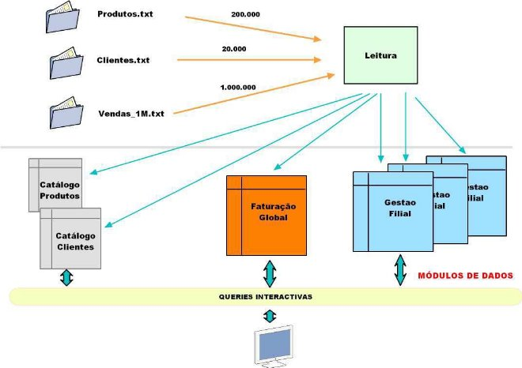

# C Project: Sales Management

**Sales Management of a Distribution Chain with 3 Branches**

**1.- Introduction and Objectives.**

Programming principles, more suitable for large-scale programming, namely:

- Modularity and data encapsulation;
- Creation of reusable code;
- Optimized choice of data structures and reuse;
- Performance tests and even profiling.

This project, to be developed in group work (of a maximum of 3 students), aims to experiment and apply these software development practices using the C language (but which are extendable to other languages ​​and paradigms).

**2.- Requirements of the program to be developed.**

The project to be developed in C (using gcc), called **SalesManagement**, has as its data source three text files available in the course's BB.

In the Produtos.txt file, each line represents the code of a product salable in the hypermarket, with each code consisting of two capital letters and 4 digits (representing an integer between 1000 and 1999), cf. the examples,

AB9012

XY1185

BC9190

The product file will contain around 200,000 product codes.

In the Clientes.txt file, each line represents the code of a customer identified in the hypermarket, with each customer code consisting of a capital letter and 4 digits representing an integer between 1000 and 5000, cf. the examples:

F2916 W1219 F2915 

The customer file will contain around 20,000 customer codes.

The file that will be the project's largest source of data is called Sales\_1M.txt, in which each line represents the record of a sale made in any of the 3 branches of the Distribution Chain. Each line (which we will call purchase or sale, which just depends on your point of view) will be made up of a product code, a decimal unit price (between 0.0 and 999.99), the integer number of units purchased (between 1 and 200) , the letter N or P depending on whether it was a Normal purchase or a Promotion purchase, the customer code, the month of purchase (1 .. 12) and the branch (from 1 to 3) where the sale was made, cf. the following examples:

KR1583 77.72 128 P L4891 2 1 QQ1041 536.53 194 P X4054 12 3 OP1244 481.43 67 P Q3869 9 1 JP1982 343.2 168 N T1805 10 2 IZ1636 923.72 193 P T2220 4 2 

The initial sales file, Sales\_1M.txt, will contain 1,000,000 (1 million) sales records made in the 3 branches of the distribution chain.

For all intents and purposes, it should not be considered that all lines were “well formed” by the program that created them. Therefore, each line must be validated and such a record must only be accepted if it is valid.

In strictly numerical terms, we will therefore have a file with 1 million records, in which each line records a sale of a given quantity of a product to a given customer in a given month and at a given branch. Note that the final price is not calculated but given the quantity and unit price this will be done simply whenever necessary.

Such purchases generally involve a guaranteed high number of customers (a maximum of 20,000 but generally less as not everyone buys) and a maximum universe of 200,000 products (generally less as there are always products that no one buys).

Regardless of the volume of data, important decisions will be made regarding how to store it in memory, depending on what we intend to do with that data.

**2.1.- Application architecture.**

In order to provide a basic guideline as to the possible architecture of the application to be developed, it is in fact intended that the application has an architecture in which, as shown in the following figure, the data sources are clearly identified. , its reading and the data modules to be built:

- Reading: function or part of the main() code in which the data from the 3 files is read (and processed);
- Product Catalog: data module where the codes of all products in the Produtos.txt file must be stored, organized by alphabetical index, which will effectively allow you to know which products whose codes begin with a given letter of the alphabet, how many there are, etc.;
- Customer Catalog: data module where the codes of all customers in the Customers.txt file must be stored, also organized by alphabetical index;
- Global Invoicing: data module that will contain the data structures responsible for the efficient response to quantitative questions that relate products to their monthly sales, in Normal (N) or Promotion (P) mode, for each case saving the number of sales and the total billing value of each of these types. This module must reference all products, even those that have never been sold. This module does not contain any reference to customers, but must be able to distinguish the values ​​obtained in each branch;
- Sales by branch: data module that, based on the files read, will contain the appropriate data structures to represent the relationships, fundamental to the application, between products and customers, that is, for each product, knowing which customers use it purchased, how many units each purchased, in which month and in which branch.

For the optimized structuring of the data in this data module, it will be crucial to analyze the queries that the application must implement, always bearing in mind that we want to have the sales history organized by branches for better analysis, not forgetting that there are 3 branches in this chain.

We will thus have a first architecture of the project.

**2.2.- Interactive queries.**

**SalesManagement** must be able to provide the user with effective answers to the following questions that must be organized in an appropriate menu structure:

1. Read the 3 files (Products, Customers and Sales), whose names can be entered by the user or, optionally, assumed by default (in this case, the files mentioned above). The result of this reading should be the immediate presentation to the user of the name of the file read and the total number of lines read and validated. A new reading of these files should immediately restart and recreate the data structures in memory;
2. Determine the list and total of products whose code starts with a given letter (capital letter); Present such list to the user and allow the user to browse it, with such list presented in alphabetical order;
3. Given a month and a product code, both valid, determine and present
   3.1 total number of sales and the total invoiced with that product in that month, distinguishing the totals in mode N and the totals in mode P. The user must decide whether he wants the global result or the total values ​​branch by branch.
4. Determine the ordered list of product codes (and their total number), which no one has purchased, and the user can also decide whether they want total values ​​or divided by branches.
5. Given a customer code, create a table with the total number of products purchased (i.e. the sum of the quantities of all sales of the product), month by month (for months in which you did not purchase the entry should be 0) . The table must be displayed on a screen organized by branch.
6. Given a closed range of months, for example [3..7], determine the total sales recorded in that range and the total invoiced;
7. Determine the ordered list of customer codes that made purchases in all branches;
8. Given a product code and a branch, determine the codes (and total number) of customers who purchased it, distinguishing between purchase N and purchase P;
9. Given a customer code and a month, determine the list of product codes that you purchased most by quantity and not by billing, in descending order;
10. Create a list of the N best-selling products throughout the year, indicating the total number of customers and the number of units sold, branch by branch;
11. Given a customer code, determine the codes of the 3 products on which you spent the most money during the year;
12. Determine the number of registered customers who did not make purchases as well as the number of products that no one purchased.

**3.- Performance tests.**

After developing and coding your entire project based on the Vendas\_1M.txt file, you should carry out some performance tests and present the respective results. We intend to compare the execution times of queries 8 to 12, using the files, Vendas\_1M.txt, Vendas\_3M.txt (3 million sales) and Vendas\_5M.txt (5 million sales).

To obtain these times, the standard C time.h library or any other equivalent can be used. The times to be recorded must be homogeneous, that is, we either always record the so-called elapsed times (what the user notices) or the CPU times (processing times). Personally, I suggest elapsed times.